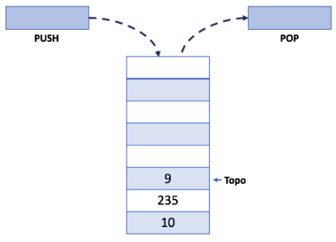

# Pilhas Lineares: Implementação em C

 
 
 
 

 

 

Diferente do tipo lista [vide git](https://github.com/mpiress/linear_list), a pilha possue uma regra básica que deve ser obedecida. Essa se refere a forma como inserimos e removemos elementos dessa estrutura. Antes de iniciarmos essa discussão, observe um exemplo ilustrativo desse tipo de dados na figura abaixo.

	 

Observe que nesse tipo de estrutura há apenas um <b>único ponteiro</b> chamado <b>Topo</b>. Os métodos associados ao tipo pilha, os quais impõem as regras, são chamados PUSH (i.e., empilhar) e POP (i.e., desempilhar).

>Logo, temos como regra básica dessa estrutura: 
> 1. O último elemento que entra sempre será o primeiro a ser removido. 

Como a pilha é definida a partir de um vetor, muitas das caracteristicas de implementação observadas no tipo lista são aproveitados para compor sua execução. A diferença está apenas na composição da regra de manipulação, o que as diferencia em termos de execução. 

# Compilação e Execução

A pilha linear disponibilizada possui um arquivo Makefile que realiza todo o procedimento de compilação e execução. Para tanto, temos as seguintes diretrizes de execução:

| Comando                |  Função                                                                                           |                     
| -----------------------| ------------------------------------------------------------------------------------------------- |
|  `make clean`          | Apaga a última compilação realizada contida na pasta build                                        |
|  `make`                | Executa a compilação do programa utilizando o gcc, e o resultado vai para a pasta build           |
|  `make run`            | Executa o programa da pasta build após a realização da compilação                                 |

# Contatos

 

<a style="color:black" href="mailto:michel@cefetmg.br?subject=[GitHub]%20Source%20Dynamic%20Lists">
✉️ <i>michel@cefetmg.br</i>
</a>
